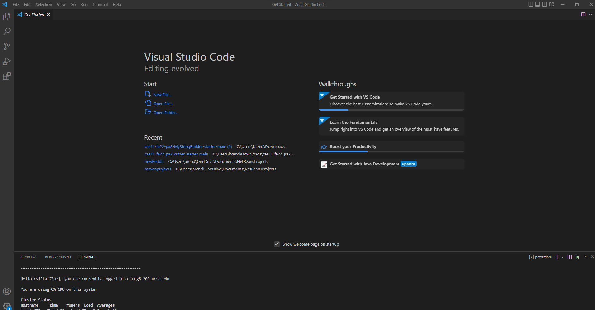
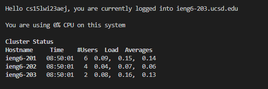

#Week 1 Lab Report

##Install VSCode
  First, to install VSCode, go to their website and download VSCode. The link is https://code.visualstudio.com/.
 Once it is installed, it should look like the image below when opened.

##Remotely Connecting
To remotely connect to the CSE15L account, you must first open a terminal by either pressing ctrl/command and ` or finding the terminal option and opening a new terminal. 
Next, you must type in the command __ssh cs15lwi23zz@ieng6.ucsd.edu__ into your terminal, with the zz replaced by your personal ID. After inpputting your password, you will then be shown a small welcome screen that looks like this.

