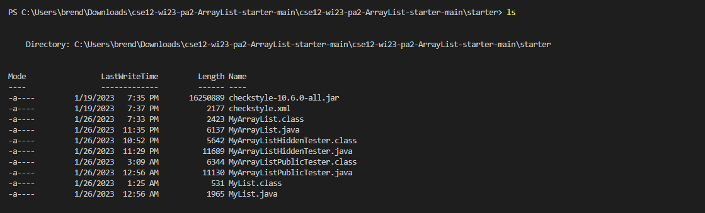

# Week 1 Lab Report

## Install VSCode
  First, to install VSCode, go to their website and download [VSCode]([VSCode](https://code.visualstudio.com/)) .
 Once it is installed, it should look like the image below when opened.

## Remotely Connecting
To remotely connect to the CSE15L account, you must first open a terminal by either pressing ctrl/command and \` or finding the terminal option and opening a new terminal. 
Next, you must type in the command `ssh cs15lwi23zz@ieng6.ucsd.edu` into your terminal, with the zz replaced by your personal ID. After inpputting your password, you will then be shown a small welcome screen that looks like this.

## Testing commands

Finally, once you are in, you can test commands. Some commands like `-cd`, which changes directory, or `ls` which lists all items in the directory.

Going more into depth with some commands,
`ls` lists all files and folers in the directory. In this instance of my CSE12 homework, it lists all the java and class files in the folder named starter.

`-cd (path)` changes the directory, which means it changes what file/folder the directory is currently pointing towards to the specificed file/folder.
