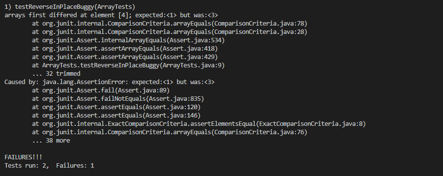

# Week 2 Lab Report


## Part 1: String Server
The purpose of the string server is to check if the user wants to add a message, and it it does, it checks the query part of a url to determine what to add. Once something is added, it is then shown on the main page of the server.
The code for the server is as shown.

How the code works is that once the server is started, it creates the string `messages` which will hold and contain all of our messages. These can then be viewed wwhen you go to the server url. When you go go to the server url, it will check if the the url's path contains the string "/add-message". If it has it, it will then check the query, or whatever is after the equals sign, and add it to to messages, along with a \n, which helps in formatting. I thought about putting all the messages into an array and then printing the array, but decided that was too much trouble and took this probably worse approach instead. Finally, `return "404 not found`  is for if the path is not "/" or does not contain "add message".

__Onto the first message__

In this image, if you see the url, you can see that I am adding the message "dunno lets find out"
After going back to the path "/", it looks like

Now, lets go over all variables in this program.
Lets start with the URL/URI. As you can see, it has the domain, which is localhost:34535, which is my computer running off of port 34535. This is the link to access the server. Then, the path is "/add-message", so the program knows to add whatever is in the query to our `messages`. When we go back to the main page of the server, we can see that our message has been added. It isn't the first message because I was making sure my code worked beforehand. There is one more String, being "Messages:", which can be seen at the top of the page. I could have added this to our string `messages`, but decided not to

__Onto the Second Message__

This time, I am adding the message "dunno lets find out"
Returning to the main path, we see that the message has been added.
 
 In terms of variables, the domain and port have not changed, but our string `messages` has, and so has our query. Our path has not. When we see the main path again, we can see how messages changed, as what was in our query has been added to `messages`. Otherwise, no variables have changed.
 
 ## Part 2:Bug Fixing
 Now, lets go onto the bug fixing. For this, I have chosen the the buggy method "reverseInPlace", as it was one of the simplest and first that I did.
 Original Code:  
 
 ```
 static void reverseInPlace(int[] arr) {
    for(int i = 0; i < arr.length; i += 1) {
      arr[i] = arr[arr.length - i - 1];
    }
  }
  ```  
  
  
  __Failure Inducing Input__  
  ```
   public void testReverseInPlaceBuggy() {
    int[] input1 = { 3,4,2,1,3,4,5,6 };
    ArrayExamples.reverseInPlace(input1);
    assertArrayEquals(new int[]{ 6,5,4,3,1,2,4,3 }, input1);
	}
   ```
  __Non-Failure Inducing Input__  
  ```
  public void testReverseInPlaceNotBuggy() {
    int[] input1 = { 3 };
    ArrayExamples.reverseInPlace(input1);
    assertArrayEquals(new int[]{ 3 }, input1);
	}
   ```
	(yes this was provided, but it works and shows off that the program isn't always buggy so I took it)  
	
  __What happens when the tests are run in JUnit__  
  
 
 As you can see, only one test failed
__Whats the Issue?__  
The bug was that our code was trying to reverse the array by writing the ith element into the ith-1 element. This works just fine until we get past the halfway point the array, at which point the ith element is no longer what it was originally, as it has been written over.
__Fixed Code__  

```
  static void reverseInPlace(int[] arr) {
    int[] tempArr = new int[arr.length];
    for(int i = 0; i < arr.length; i += 1) {
      tempArr[i] = arr[arr.length - i - 1];
    }
    for(int j=0;j<arr.length;j++){
      arr[j]=tempArr[j];
    }  
  ```  
  
Our new code writes the ith element into a new array of the same length at the ith-1 position. Then at the end, it sets the array arr[] to be the temp.
## Part 3: What did I learn?  

I learned that I hate JUnit and testing code. Hey, just cause it's important doesn't mean I have to like it. I'm just saying, I had an assignmnet in CSE12 and it took me twice as long to write the testers and test my code than it did to write my code and fix it when the testers told me something was wrong
In all seriousness, I learned how to start up servers on my computer. While they are only local, unless I do it on my CS15L account, I still think its pretty cool.
