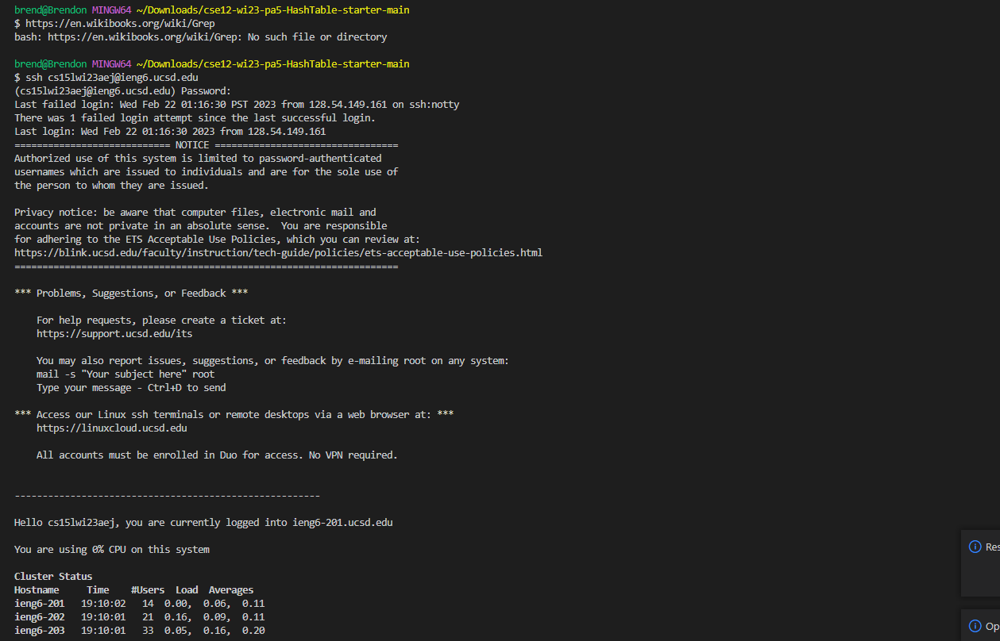
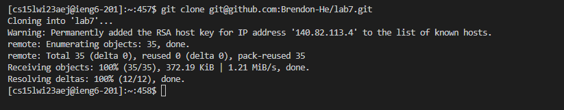
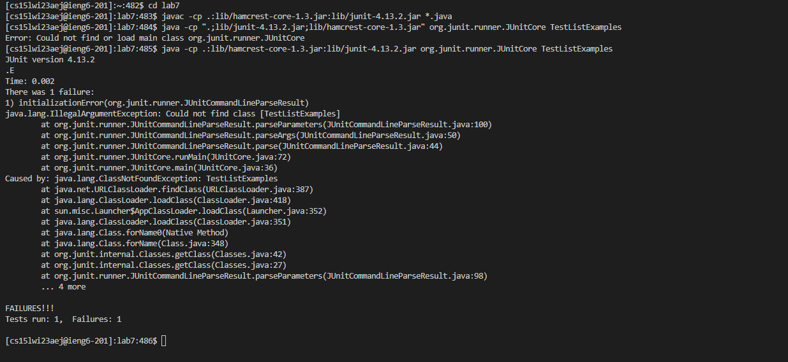
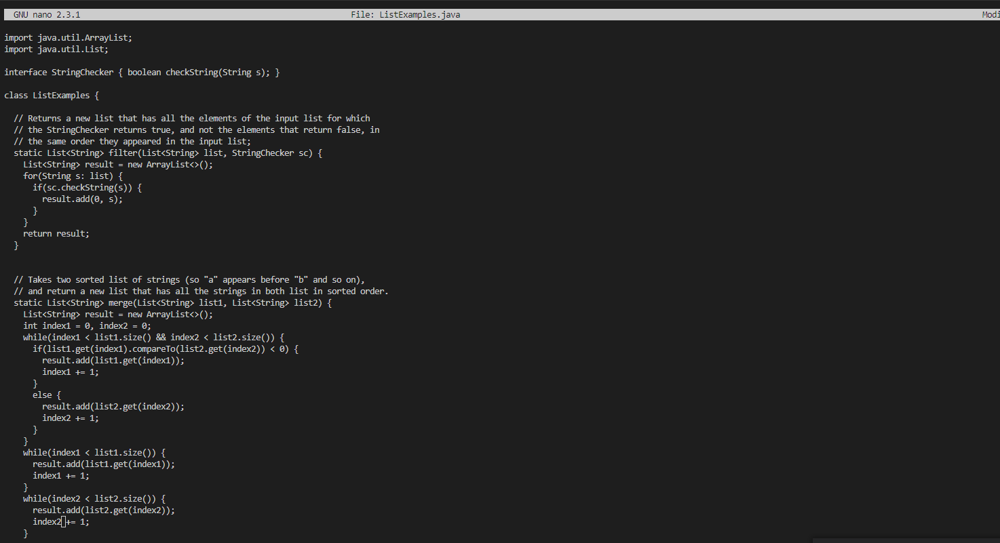
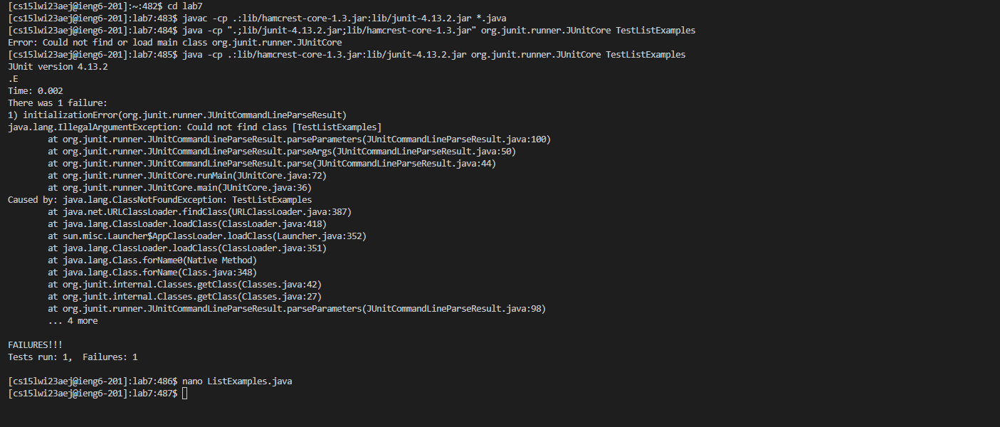
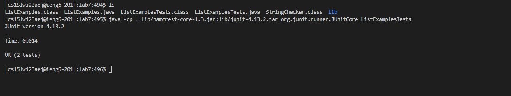
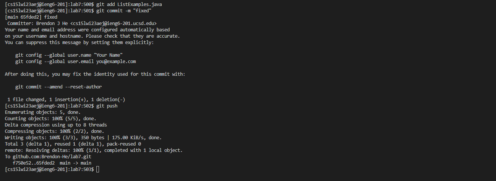
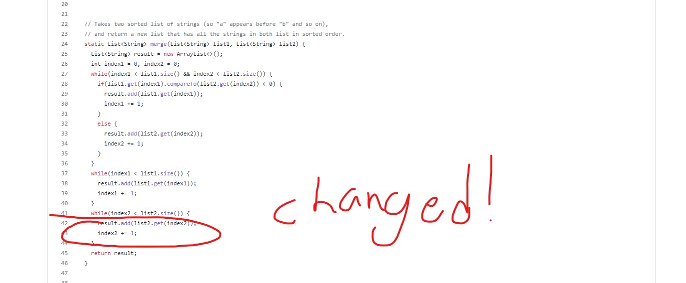

# Lab Report 4

## Important note
When I say I typed something, what I actually mean is that I had all of these commands saved in a google doc and I just ctrl c ctrl v them.
I could have done the (press up)  but I wanted to try this in one take rather than multiple. This also inclueds every instance of me saying that I typed. 
If I had to input something into the terminal/bash, it was done by copying and pasting.

## Step 4- Logging into ieng6 account
To log in, i typed in `ssh cs15lwi23aej@ieng6.ucsd.edu`. I then had to input my password. 
I know I had set up an access key to bypass the password, but I did that on a different computer, and hadn't set it up on the new computer that I am currently working on.
It then showed me logging in.

## Step 5- Cloning the Repository
I then typed in `git clone git@github.com:Brendon-He/lab7.git` to clone the repository that I had forked for the activity and then pressed  `<enter>`

## Step 6- Running the tests to show they fail
First, I cd'd into the lab7 file. Then I typed `javac -cp .;lib/hamcrest-core-1.3.jar;lib/junit-4.13.2.jar *.java` and 
`java -cp .;lib/junit-4.13.2.jar;lib/hamcrest-core-1.3.jar org.junit.runner.JUnitCore TestListExamples.java` to run and compile the code.
I had an error because I accidentally including quotation marks in my first attempt. I pressed `<enter>` after every line.

## Step 7- Fixing the error
To fix the error, I first had to open the java file in nano, which I did by typing in `nano ListExamples.java`.
This opened the file in nano. I had previously tried searching for the specific line with the issue, but I learned that there is nothing unique about or around the line with the error.
So, I just manually pressed `<down>` and changed the line from `index1 += 1;` to `index2 += 1;` In the image below, I have already changed it. 
The line that was changed is the second to bottom line on the image. 

I then pressed(not typed) `<command-O>`, then pressed enter to save the change in the file, and then pressed `<command-X>` to exit nano, bringing me back to the terminal

## Step 8- Showing that my code works
I then typed in the command to recompile and rerun the test file. I could have just pressed up as I have run the tests before, but why change what I've been doing? Of course, I pressed `<enter>` to execute the command

## Step 9- Committing and Pushing the changes
I then typed in `git add ListExamples.java` to commit the changes, and then `git commit -m "fixed"`to add the message, and finally `git push`to push the changes to github.

Finally, I went to my github account and navigated to the lab7 repo that I copied and checked that the file was actually changed

